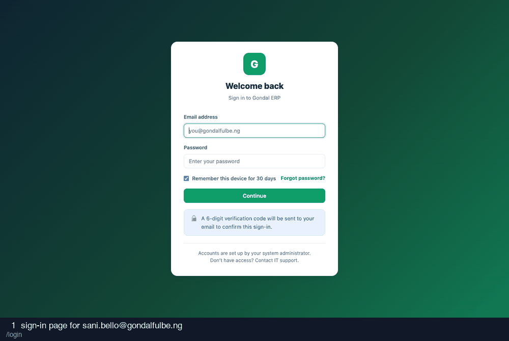

# 01-collection-agent — recording

28 frames · 1.8s each

| # | What is on screen | URL |
| --- | --- | --- |
| 1 | sign-in page for sani.bello@gondalfulbe.ng | `/login` |
| 2 | credentials entered | `/login` |
| 3 | after submitting credentials | `/login/verify` |
| 4 | two-factor code entered (read from the database) | `/login/verify` |
| 5 | after submitting the two-factor code | `/` |
| 6 | deliveries list | `/milk-flow/deliveries` |
| 7 | record-delivery modal open | `/milk-flow/deliveries#modal-record` |
| 8 | delivery form filled: 22 L presented | `/milk-flow/deliveries#modal-record` |
| 9 | after saving the delivery | `/milk-flow/deliveries/539#` |
| 10 | record modal again for Save & add another | `/milk-flow/deliveries#modal-record` |
| 11 | after Save & add another | `/milk-flow/deliveries?point=1#modal-record` |
| 12 | record modal for a rejection | `/milk-flow/deliveries#modal-record` |
| 13 | 20 L presented, 5 L rejected with a reason | `/milk-flow/deliveries#modal-record` |
| 14 | after saving the rejection | `/milk-flow/deliveries/541#` |
| 15 | record modal for the cut-off case | `/milk-flow/deliveries#modal-record` |
| 16 | delivery timed 09:45, after the 07:00 cut-off | `/milk-flow/deliveries#modal-record` |
| 17 | after submitting past the cut-off | `/milk-flow/deliveries#` |
| 18 | farmers register | `/farmers` |
| 19 | enrol-farmer modal | `/farmers#modal-enrol` |
| 20 | enrol form filled | `/farmers#modal-enrol` |
| 21 | after enrolling the farmer | `/farmers/1847#` |
| 22 | consignments list | `/milk-flow/consignments` |
| 23 | dispatch modal open | `/milk-flow/consignments#modal-dispatch` |
| 24 | dispatch modal, 3 deliveries available | `/milk-flow/consignments#modal-dispatch` |
| 25 | after dispatching | `/milk-flow/consignments#` |
| 26 | consignments, checking for grade controls | `/milk-flow/consignments` |
| 27 | deliveries, checking scope | `/milk-flow/deliveries` |
| 28 | attempting payroll | `/payroll` |
