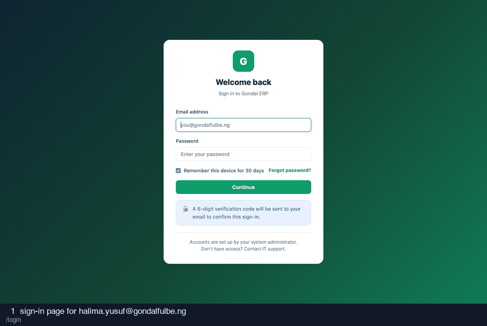

# 02-collection-officer — recording

27 frames · 1.8s each

| # | What is on screen | URL |
| --- | --- | --- |
| 1 | sign-in page for halima.yusuf@gondalfulbe.ng | `/login` |
| 2 | credentials entered | `/login` |
| 3 | after submitting credentials | `/login/verify` |
| 4 | two-factor code entered (read from the database) | `/login/verify` |
| 5 | after submitting the two-factor code | `/` |
| 6 | consignments at my centre | `/milk-flow/consignments` |
| 7 | consignments, looking for Adjust | `/milk-flow/consignments` |
| 8 | adjust modal open | `/milk-flow/consignments#modal-adjust-24` |
| 9 | adjustment of -2.5 L with a reason | `/milk-flow/consignments#modal-adjust-24` |
| 10 | after recording the adjustment | `/milk-flow/consignments#` |
| 11 | confirm modal open | `/milk-flow/consignments#modal-confirm-24` |
| 12 | confirm modal, recording test 1 | `/milk-flow/consignments#modal-confirm-24` |
| 13 | confirm modal, recording test 2 | `/milk-flow/consignments#modal-confirm-24` |
| 14 | confirm modal, recording test 3 | `/milk-flow/consignments#modal-confirm-24` |
| 15 | after recording 3/3 quality tests | `/milk-flow/consignments#` |
| 16 | confirm modal with tests complete | `/milk-flow/consignments#modal-confirm-24` |
| 17 | grade chosen on the confirm form | `/milk-flow/consignments#modal-confirm-24` |
| 18 | after confirming with a grade | `/milk-flow/consignments#` |
| 19 | consignments, looking for Assign grade | `/milk-flow/consignments` |
| 20 | batches list | `/milk-flow/batches` |
| 21 | collection centres list | `/collection-centers` |
| 22 | my collection centre | `/collection-centers/1` |
| 23 | dispatch-batch modal | `/collection-centers/1#modal-batch` |
| 24 | batch modal, 1 eligible consignments | `/collection-centers/1#modal-batch` |
| 25 | after dispatching the batch | `/milk-flow/batches/11#` |
| 26 | attempting factory reconciliation | `/reconciliation` |
| 27 | collection centres list | `/collection-centers` |
