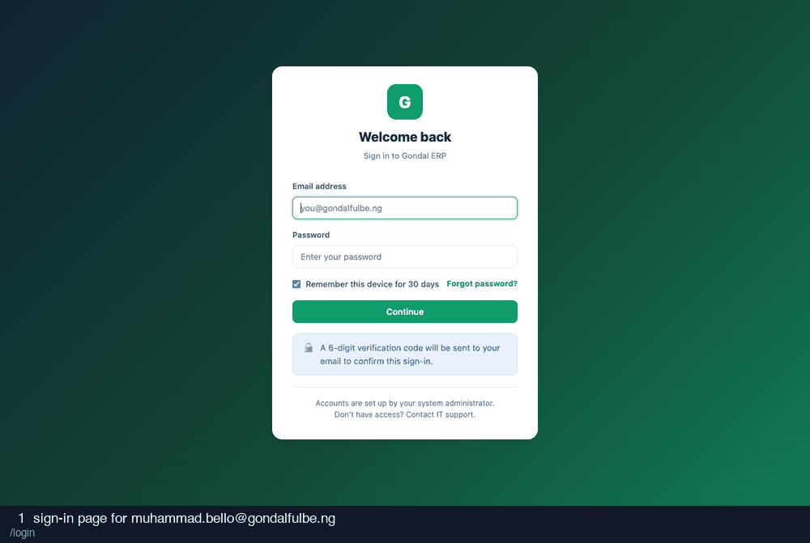

# 03-milk-supervisor — recording

15 frames · 1.8s each

| # | What is on screen | URL |
| --- | --- | --- |
| 1 | sign-in page for muhammad.bello@gondalfulbe.ng | `/login` |
| 2 | credentials entered | `/login` |
| 3 | after submitting credentials | `/login/verify` |
| 4 | two-factor code entered (read from the database) | `/login/verify` |
| 5 | after submitting the two-factor code | `/` |
| 6 | factory reconciliation | `/reconciliation` |
| 7 | reconcile modal, big variance | `/reconciliation#modal-reconcile-2` |
| 8 | received litres ~50% below dispatched, no cause given | `/reconciliation#modal-reconcile-2` |
| 9 | after submitting a big unexplained variance | `/reconciliation#` |
| 10 | reconcile modal, within tolerance | `/reconciliation#modal-reconcile-2` |
| 11 | received equals dispatched | `/reconciliation#modal-reconcile-2` |
| 12 | after reconciling within tolerance | `/reconciliation#` |
| 13 | reconciliation after the batch was reconciled | `/reconciliation` |
| 14 | collection points | `/collection-points` |
| 15 | supervisor dashboard | `/` |
