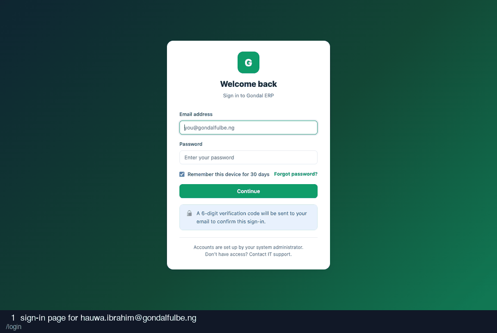

# 04-sales-officer — recording

14 frames · 1.8s each

| # | What is on screen | URL |
| --- | --- | --- |
| 1 | sign-in page for hauwa.ibrahim@gondalfulbe.ng | `/login` |
| 2 | credentials entered | `/login` |
| 3 | after submitting credentials | `/login/verify` |
| 4 | two-factor code entered (read from the database) | `/login/verify` |
| 5 | after submitting the two-factor code | `/` |
| 6 | shop sales | `/shop/sales` |
| 7 | record-sale modal | `/shop/sales#modal-sale` |
| 8 | one-item cash sale filled | `/shop/sales#modal-sale` |
| 9 | after recording the one-item sale | `/shop/sales#` |
| 10 | record-sale modal for the over-stock case | `/shop/sales#modal-sale` |
| 11 | quantity far beyond stock | `/shop/sales#modal-sale` |
| 12 | after trying to oversell | `/shop/sales#` |
| 13 | sales screen, checking money tiles | `/shop/sales` |
| 14 | a sale I recorded | `/shop/sales/8` |
