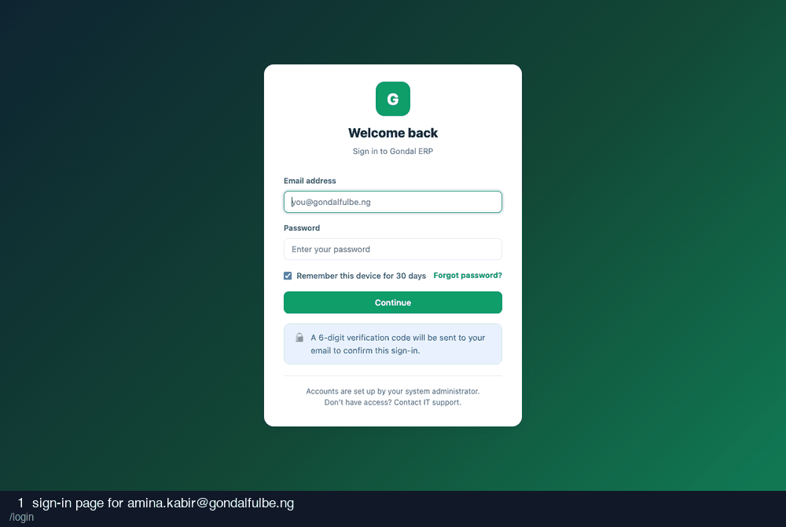

# 05-shop-manager — recording

13 frames · 1.8s each

| # | What is on screen | URL |
| --- | --- | --- |
| 1 | sign-in page for amina.kabir@gondalfulbe.ng | `/login` |
| 2 | credentials entered | `/login` |
| 3 | after submitting credentials | `/login/verify` |
| 4 | two-factor code entered (read from the database) | `/login/verify` |
| 5 | after submitting the two-factor code | `/` |
| 6 | shop sales as manager | `/shop/sales` |
| 7 | an unvoided sale, as manager | `/shop/sales/8` |
| 8 | void modal | `/shop/sales/8#modal-void` |
| 9 | void reason entered | `/shop/sales/8#modal-void` |
| 10 | after voiding the sale | `/shop/sales/8#` |
| 11 | inventory | `/shop/inventory` |
| 12 | a product | `/shop/products/6` |
| 13 | product categories | `/shop/categories` |
