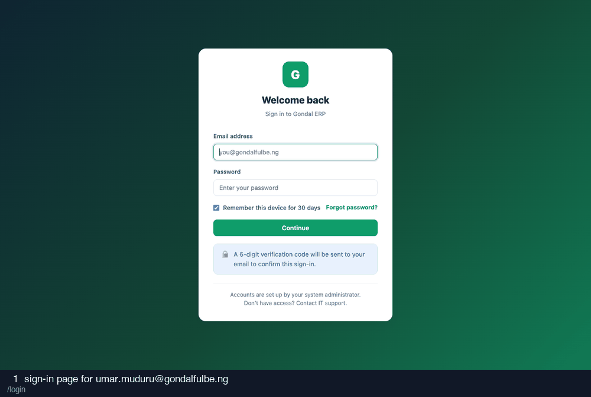

# 09-internal-audit — recording

15 frames · 1.8s each

| # | What is on screen | URL |
| --- | --- | --- |
| 1 | sign-in page for umar.muduru@gondalfulbe.ng | `/login` |
| 2 | credentials entered | `/login` |
| 3 | after submitting credentials | `/login/verify` |
| 4 | two-factor code entered (read from the database) | `/login/verify` |
| 5 | after submitting the two-factor code | `/` |
| 6 | audit log | `/admin/audit-log` |
| 7 | audit log filtered to a denial reference | `/admin/audit-log?q=DENY-0001` |
| 8 | audit reading deliveries | `/milk-flow/deliveries` |
| 9 | audit reading sales | `/shop/sales` |
| 10 | audit reading farmers | `/farmers` |
| 11 | audit reading employees | `/employees` |
| 12 | audit reading logistics | `/logistics` |
| 13 | read-only check: deliveries | `/milk-flow/deliveries` |
| 14 | read-only check: sales | `/shop/sales` |
| 15 | read-only check: farmers | `/farmers` |
