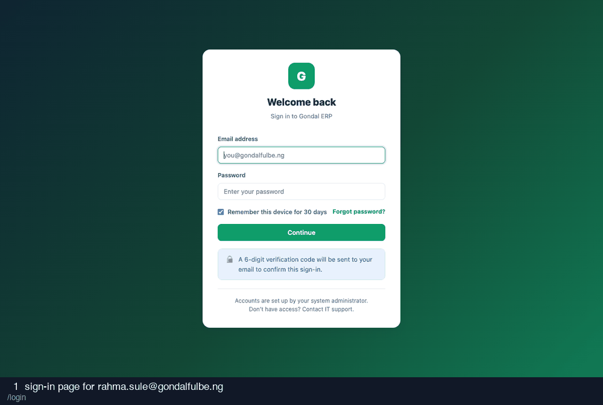

# 11-hr-manager — recording

10 frames · 1.8s each

| # | What is on screen | URL |
| --- | --- | --- |
| 1 | sign-in page for rahma.sule@gondalfulbe.ng | `/login` |
| 2 | credentials entered | `/login` |
| 3 | after submitting credentials | `/login/verify` |
| 4 | two-factor code entered (read from the database) | `/login/verify` |
| 5 | after submitting the two-factor code | `/` |
| 6 | employee register | `/employees` |
| 7 | departments | `/departments` |
| 8 | positions | `/positions` |
| 9 | request-leave modal | `/leave#modal-leave` |
| 10 | approvals queue as HR Manager | `/approvals` |
