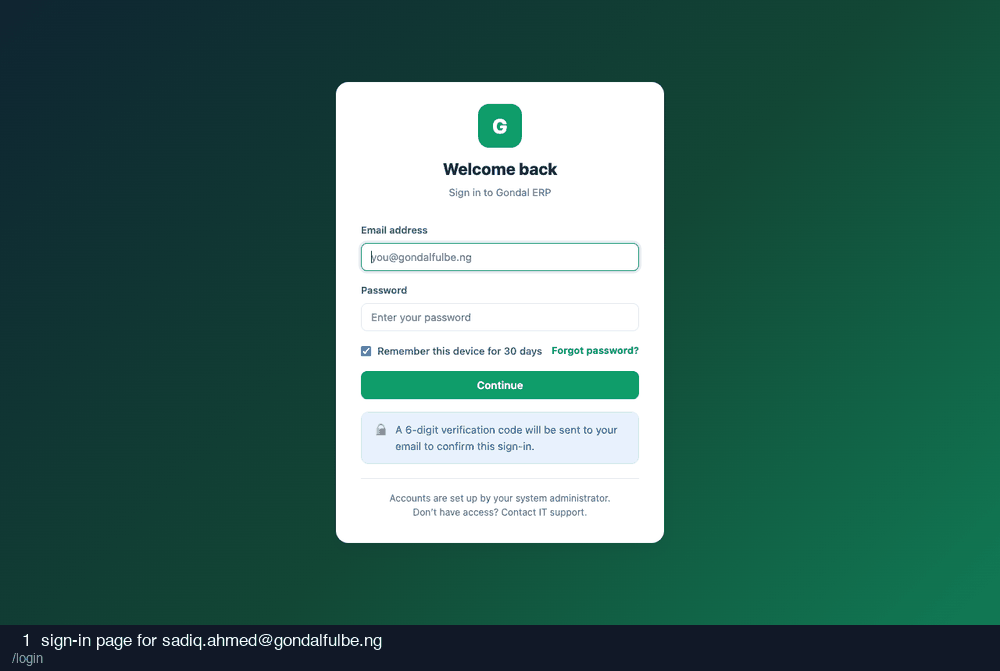

# 13-system-administrator — recording

9 frames · 1.8s each

| # | What is on screen | URL |
| --- | --- | --- |
| 1 | sign-in page for sadiq.ahmed@gondalfulbe.ng | `/login` |
| 2 | credentials entered | `/login` |
| 3 | after submitting credentials | `/login/verify` |
| 4 | two-factor code entered (read from the database) | `/login/verify` |
| 5 | after submitting the two-factor code | `/` |
| 6 | user administration | `/admin/users` |
| 7 | assign-role modal | `/admin/users/14#modal-assign` |
| 8 | permission tests | `/admin/permission-tests` |
| 9 | settings | `/admin/settings` |
